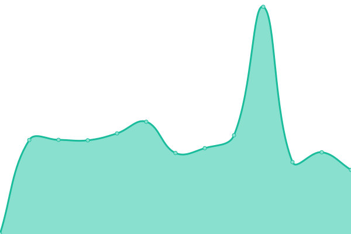

# [📈 Live Status](https://apps.kedi.dev): <!--live status--> **🟧 Partial outage**

This repository contains the open-source uptime monitor and status page for [Ananth](https://coredump.blog), powered by [Upptime](https://github.com/upptime/upptime).

With [Upptime](https://upptime.js.org), you can get your own unlimited and free uptime monitor and status page, powered entirely by a GitHub repository. We use [Issues](https://github.com/ananthb/apps.kedi.dev/issues) as incident reports, [Actions](https://github.com/ananthb/apps.kedi.dev/actions) as uptime monitors, and [Pages](https://apps.kedi.dev) for the status page.

<!--start: status pages-->
<!-- This summary is generated by Upptime (https://github.com/upptime/upptime) -->
<!-- Do not edit this manually, your changes will be overwritten -->
<!-- prettier-ignore -->
| URL | Status | History | Response Time | Uptime |
| --- | ------ | ------- | ------------- | ------ |
|  [Immich](https://imm.tail42937.ts.net) | 🟥 Down | [immich.yml](https://github.com/ananthb/apps.kedi.dev/commits/HEAD/history/immich.yml) | 

 1129ms
     
 | 

<a href="https://apps.kedi.dev/history/immich">81.22%</a>
    

|  [Seafile](https://sf.tail42937.ts.net) | 🟥 Down | [seafile.yml](https://github.com/ananthb/apps.kedi.dev/commits/HEAD/history/seafile.yml) | 

 1906ms
     
 | 

<a href="https://apps.kedi.dev/history/seafile">90.44%</a>
    

|  [Jellyfin](https://tv.tail42937.ts.net) | 🟩 Up | [jellyfin.yml](https://github.com/ananthb/apps.kedi.dev/commits/HEAD/history/jellyfin.yml) | 

 1474ms
     
 | 

<a href="https://apps.kedi.dev/history/jellyfin">91.88%</a>
    

|  [Jellyseerr](https://watch.tail42937.ts.net) | 🟥 Down | [jellyseerr.yml](https://github.com/ananthb/apps.kedi.dev/commits/HEAD/history/jellyseerr.yml) | 

 3265ms
     
 | 

<a href="https://apps.kedi.dev/history/jellyseerr">72.02%</a>
    

|  [Actual Budget](https://ab.tail42937.ts.net) | 🟥 Down | [actual-budget.yml](https://github.com/ananthb/apps.kedi.dev/commits/HEAD/history/actual-budget.yml) | 

 1198ms
     
 | 

<a href="https://apps.kedi.dev/history/actual-budget">78.54%</a>
    

|  [Radicale](https://cal.tail42937.ts.net) | 🟥 Down | [radicale.yml](https://github.com/ananthb/apps.kedi.dev/commits/HEAD/history/radicale.yml) | 

 1847ms
     
 | 

<a href="https://apps.kedi.dev/history/radicale">81.99%</a>
    

<!--end: status pages-->

[**Visit our status website →**](https://apps.kedi.dev)

## 📄 License

- Powered by: [Upptime](https://github.com/upptime/upptime)
- Code: [MIT](./LICENSE) © [Anand Chowdhary](https://anandchowdhary.com), supported by [Pabio](https://pabio.com)
- Data in the `./history` directory: [Open Database License](https://opendatacommons.org/licenses/odbl/1-0/)
